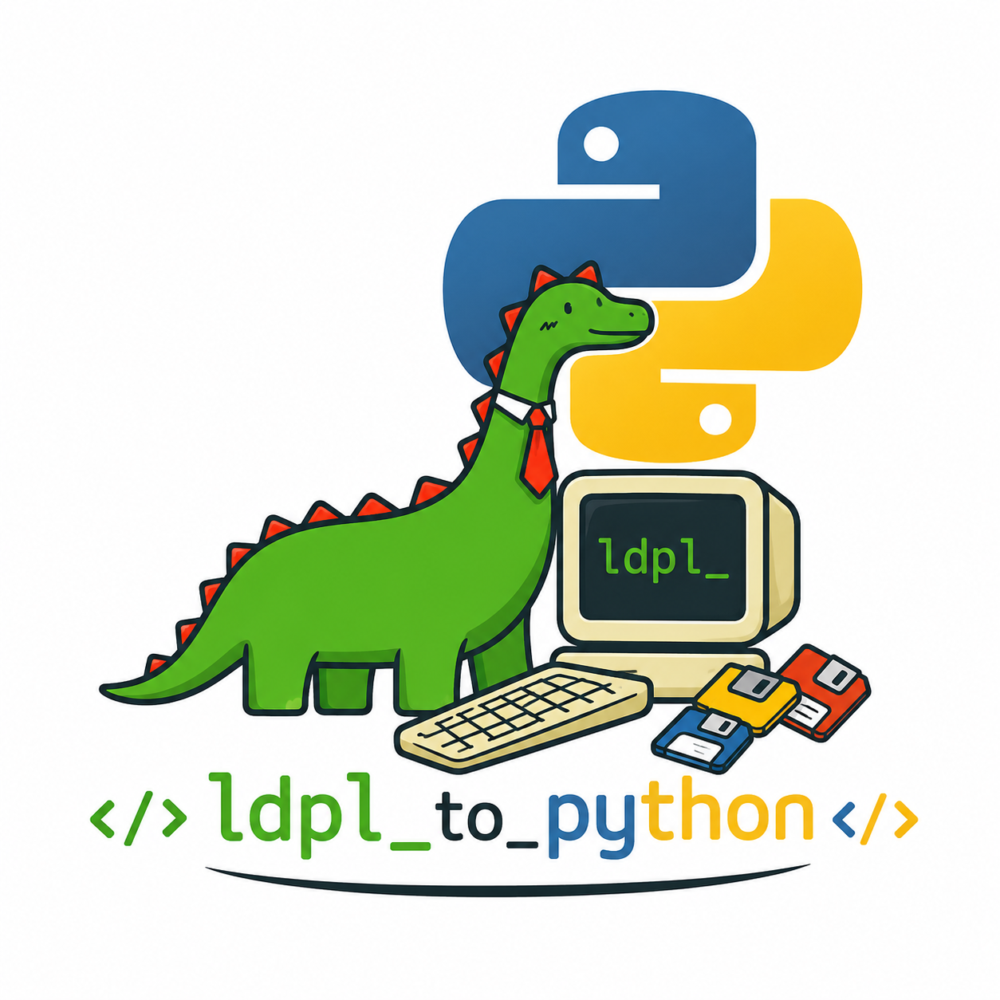

<p align="center">

</p>

<div align="center">

[](https://www.python.org/)
[](https://docs.ldpl-lang.org/)
[](https://docs.astral.sh/uv/)
[](https://typer.tiangolo.com/)
[](https://docs.astral.sh/ruff/)
[](https://mypy-lang.org/)
[](https://pytest.org/)
[](https://pytest-benchmark.readthedocs.io/)
[](.github/workflows/ci.yml)
[](https://docs.astral.sh/uv/)
[](LICENSE)

</div>

# ldpltopy

Transpilador en **Python 3.13** que convierte un **subset documentado de [LDPL](https://docs.ldpl-lang.org/)** a código Python 3.13. La arquitectura es por fases (**lexer → parser recursivo → AST propio → emisión de Python**), no un conversor monolítico basado en expresiones regulares sobre el programa completo.

Referencia oficial del lenguaje: [documentación LDPL](https://docs.ldpl-lang.org/) (estructura `data:` / `procedure:`, tipos `number` y `text`, E/S, flujo, etc.).

## Requisitos

- ⚡ [uv](https://docs.astral.sh/uv/)
- 🐍 Python **3.13** (el repo incluye `.python-version` para `uv sync`)

## Instalación

```bash
git clone git@github.com:cavazquez/ldpltopy.git
cd ldpltopy
uv sync --group dev
```

## Uso con uv

Emitir Python por **stdout**:

```bash
uv run ldpltopy programa.ldpl
```

Escribir a un archivo:

```bash
uv run ldpltopy programa.ldpl -o salida.py
```

Ejecutar el módulo:

```bash
uv run python -m ldpltopy programa.ldpl
```

### Chequeos locales (paridad con CI)

```bash
./scripts/check-ci.sh
```

## Ejemplo mínimo (`procedure:` sin variables)

```ldpl
procedure:
display "Hello World!" crlf
```

## Ejemplo con variables y bucle

Ver `tests/fixtures/09_while.ldpl` y el Python esperado en `tests/fixtures/09_while_expected.py`.

## Subset LDPL implementado

Este proyecto **no** implementa LDPL completo. El subset es **testeado y extensible**, alineado con la especificación donde aplica:

- Secciones **`data:`** (opcional) y **`procedure:`** (obligatoria).
- Declaraciones **`nombre is number|text`**, listas **`number list` / `text list`**, mapas **`number map` / `text map`** (mapas como `dict` en Python; claves en texto).
- **`store … in …`**, con índice o clave: **`store x in lista : i`**, **`store x in mapa : clave`** (clave/índice como literal o variable).
- **`in … solve …`** con **`in var : clave solve expr`** para listas/mapas.
- **`display`** / **`join`** con partes **`nombre : clave`** para leer elemento.
- **`push … to …`** (listas).
- **`display`** y **`print`**; literales y escapes; **`in … join …`**; **`in … solve …`** (`+ - * /`, paréntesis, menos unario).
- **`accept`** (texto / número con `Redo from start`).
- Flujo: **`if` / `else if` / `else` / `end if`**, **`while … do` / `repeat`**, condiciones compuestas **`and` / `or` / `not`** y paréntesis, **`for … from … to … [step …] do`** (to **inclusive**; step opcional), **`for each … in …`**, **`break` / `continue`**.
- Aritmética por sentencia: **`add`**, **`subtract`** (semántica *subtract A from B* → `B - A`), **`multiply`**, **`divide`**, **`modulo`**, **`floor`**, **`ceil`**, **`increment`**, **`decrement`**, **`get random`**.
- Texto: **`get length of`**, **`trim`**, **`replace … with … in`**.
- **`sub … end sub`** con **`parameters:`**, **`local data:`**, **`procedure:`** opcionales; **`call … with …`** (paso por referencia emulado con listas de un elemento); **`return`** dentro de sub.
- E/S archivos: **`load file … in …`**, **`write … to file …`**, **`append … to file …`**. Si en `data:` existen **`errorcode`** y **`errortext`** (nombres en minúsculas) y el programa usa estas sentencias, se actualizan códigos/mensajes mínimos en errores (subset); tras cada operación de archivo se copian **`_ldpl_ec` / `_ldpl_et`** a esas variables para que un **`display`** posterior vea el estado acumulado.
- **`include "ruta"`** (preprocesador): inserta el archivo; rutas relativas al fichero `.ldpl` que se está compilando (la CLI pasa la ruta absoluta del fuente).
- Comparaciones escalares según [flow](https://docs.ldpl-lang.org/flow/).
- **`lf`** / **`crlf`**.

### Tabla de cobertura

| Característica LDPL | Estado |
| --- | --- |
| Secciones `data:` / `procedure:` | **Soportado** (subset) |
| Tipos escalares `number`, `text` | **Soportado** |
| Listas / mapas escalares | **Soportado** (subset: sin multicontenedores ni `split` listas, etc.) |
| `sub` / `call` / `parameters` / `local data` / `return` | **Soportado** (subset; ver emisión Python) |
| `for`, `for each`, `break`, `continue` | **Soportado** |
| `include` | **Soportado** (preprocesador; rutas relativas al `.ldpl`) |
| `flag`, `extension`, `call external` | **Pendiente** |
| Aritmética (`add`, `multiply`, `floor`, `get random`, …) | **Soportado** (subset documentado arriba; no toda la doc LDPL) |
| Texto (`replace`, `trim`, `get length`, …) | **Parcial** (`split` y otras sentencias pendientes) |
| E/S archivos (`load` / `write` / `append`) | **Soportado** (subset + `errorcode`/`errortext` opcional) |
| Condiciones compuestas | **Soportado** |
| `goto` / `label`, `create statement`, extensiones C++ | **Pendiente** |
| Insensibilidad a mayúsculas (A–Z) | **Soportado** en identificadores/palabras clave tokenizadas |

### Tests

Los casos en `tests/fixtures/` siguen el esquema `NN_slug.ldpl` y `NN_slug_expected.py` (golden del transpilador). Los `include` de prueba usan fragmentos fuera de `*.ldpl` cuando el fragmento no es un programa completo (p. ej. `22_include_fragment.txt`). Ejemplos de backfill: `21_io_errorcode` (`errorcode`/`errortext` tras fallo de `load`), `23_case_insensitive` (palabras clave en mayúsculas), `24_solve_list` (`in lista : índice solve …`), `25_append_file` (`append … to file`).

## Calidad y tests

```bash
uv sync --group dev
uv run ruff check .
uv run ruff format --check .
uv run mypy .
uv run pytest --benchmark-disable
```

## Benchmarks (pytest-benchmark)

Incluidos en `tests/test_benchmarks.py` (tokenizar líneas, parsear, transpilar y ejecutar el Python generado en un caso simple):

```bash
uv run pytest tests/test_benchmarks.py --benchmark-only
```

En CI los benchmarks se desactivan (`--benchmark-disable`) para tiempos estables.

## Licencia

Este proyecto se distribuye bajo la **GNU General Public License v3.0** (SPDX: `GPL-3.0-only`). El texto completo está en el archivo [`LICENSE`](LICENSE).
